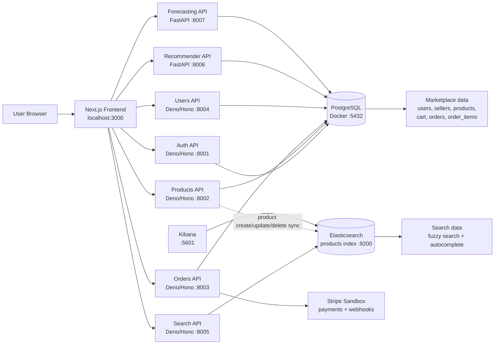

# Smart Marketplace System Architecture

## Runtime Flow

1. The user interacts with the `Next.js` frontend on port `3000`.
2. The frontend calls separate backend services through `frontend/lib/api.ts`.
3. Deno/Hono APIs handle authentication, products, users, orders, and search.
4. PostgreSQL is the source of truth for users, sellers, products, carts, and orders.
5. Product data is indexed into Elasticsearch for smart search and autocomplete.
6. Python FastAPI services provide recommendations and sales forecasting.
7. Stripe sandbox handles payment intents and checkout-related payment flow.
8. Kibana is used to inspect Elasticsearch indices and debug search queries.

## Ports

| Component | Technology | Port |
| --- | --- | --- |
| Frontend | Next.js | `3000` |
| Auth API | Deno/Hono | `8001` |
| Products API | Deno/Hono | `8002` |
| Orders API | Deno/Hono | `8003` |
| Users API | Deno/Hono | `8004` |
| Search API | Deno/Hono + Elasticsearch | `8005` |
| Recommender API | Python FastAPI | `8006` |
| Forecasting API | Python FastAPI | `8007` |
| PostgreSQL | Docker | `5432` |
| Elasticsearch | Docker | `9200` |
| Kibana | Docker | `5601` |
